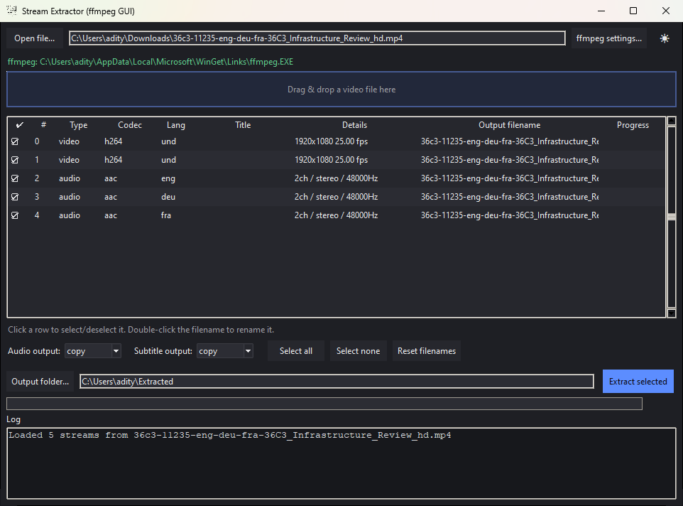
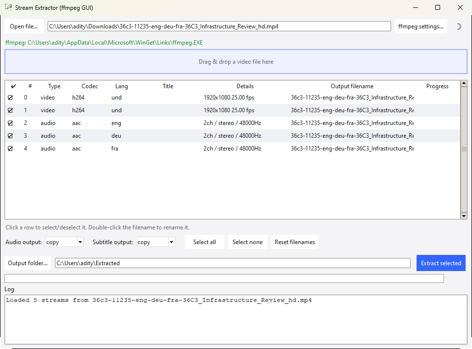
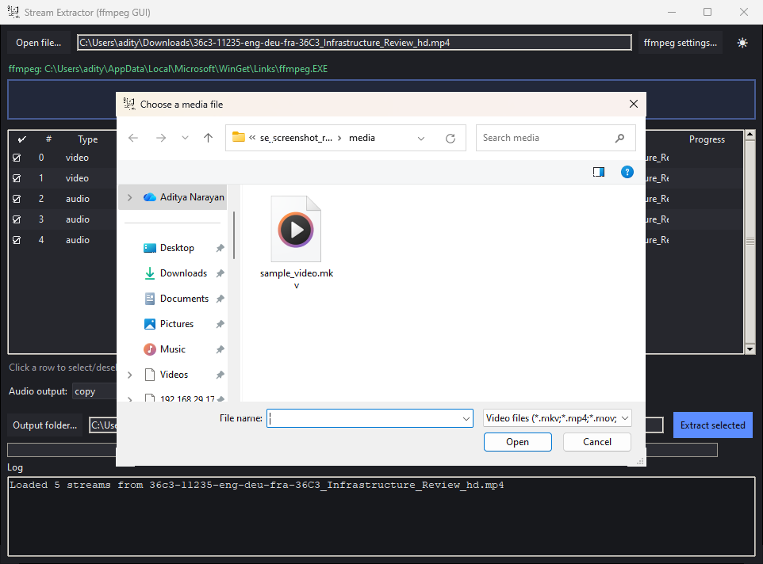
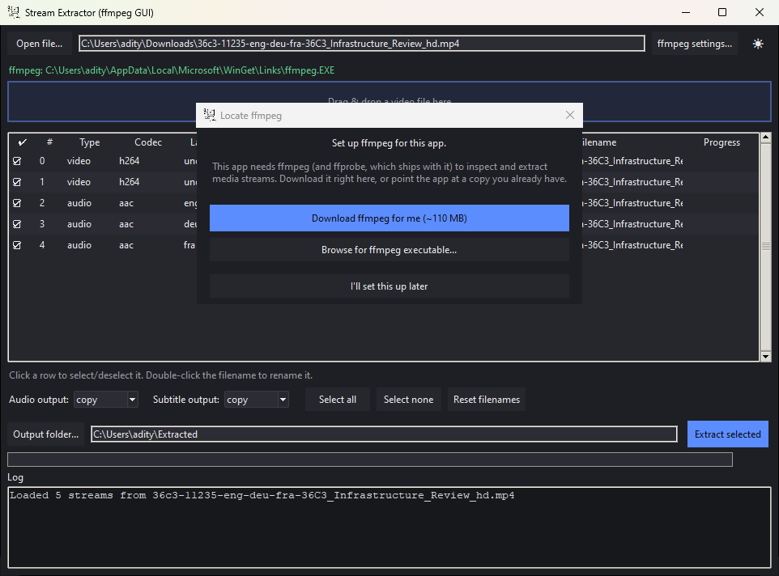
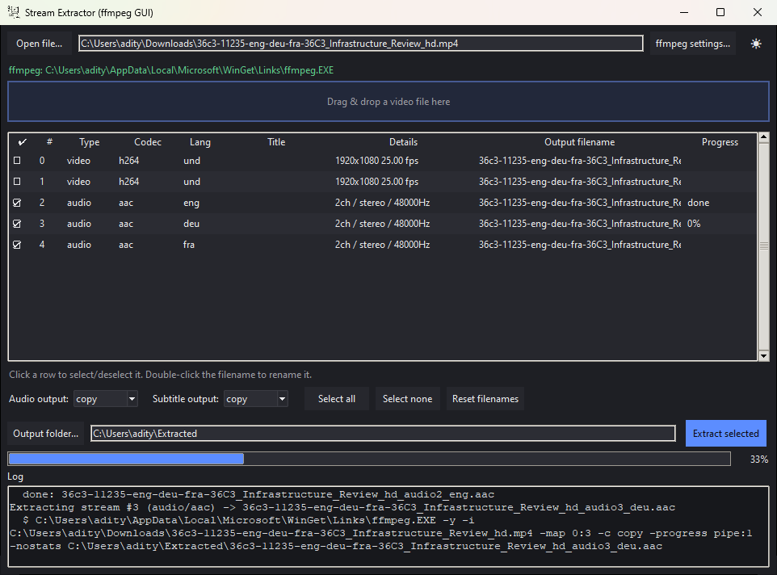

<p align="center">
  
</p>

<h1 align="center">Stream Extractor</h1>

<p align="center">
  A small, modern desktop GUI for pulling individual video, audio (including dual/multi audio),
  and subtitle tracks out of a media file — built on <a href="https://ffmpeg.org">ffmpeg</a>.
</p>

<p align="center">
  <a href="../../releases/latest/download/StreamExtractor.exe">
    
  </a>
  <a href="../../releases">
    
  </a>
</p>

---

## Screenshots

<p align="center">
  
  
</p>
<p align="center">
  
  
  
</p>

---

## Features

- **Inspect any media file** — see every embedded video, audio, and subtitle stream (codec, language, channels/resolution) before you touch anything.
- **Dual / multi-audio support** — each audio track is listed and extracted separately.
- **Subtitle extraction** — text-based subtitles (SubRip/ASS/mov_text) can be copied as-is or converted to `.srt`; image-based subtitles (PGS/VobSub) are always kept in their native format.
- **Drag & drop** a file straight onto the window (optional, see below).
- **Editable output filenames** — double-click any row's filename to rename it before extracting.
- **Light / dark theme**, toggled with the ☽ / ☀ button.
- **Live progress bars** — per-stream and overall, while ffmpeg runs in the background.
- **Built-in ffmpeg setup** — if ffmpeg isn't found, the app downloads a build for you (no browser detour), or you can browse to a copy you already have.
- **No install needed on the client machine** — the released `.exe` bundles Python and every dependency inside it, and never flashes a console window.

## Download

Grab the latest `StreamExtractor.exe` with the **Download** button above, or from the [Releases](../../releases) page. No Python, pip, or ffmpeg-on-PATH setup is required to run it — on first launch, if it can't find ffmpeg automatically, it offers to **download ffmpeg for you** (with a progress bar, straight into `%LOCALAPPDATA%\StreamExtractor\ffmpeg`) or to **browse** to a copy you already have.

## Running from source

```bash
git clone <this-repo-url>
cd <this-repo>
pip install -r requirements.txt   # tkinterdnd2 is optional, see below
python stream_extractor.py
```

Requirements:
- Python 3.8+
- `ffmpeg` / `ffprobe` — the app finds them on your PATH, **downloads them for you** if they're missing, or you can point **"ffmpeg settings..."** at a copy you already have
- On Linux, tkinter itself may need a system package: `sudo apt install python3-tk`
- Optional, for drag-and-drop: `pip install tkinterdnd2` — the app works fine without it, you just use **"Open file..."** instead

## Building the .exe yourself

```bash
pip install -r requirements.txt
pyinstaller --onefile --windowed --name StreamExtractor --icon assets/icon.ico stream_extractor.py
```

The result lands in `dist/StreamExtractor.exe`, with ffmpeg-dependency-free packaging: everything the app needs (Python runtime, tkinter, dependencies) is bundled inside. ffmpeg itself is **not** bundled — it's a separate, much larger download, so the app downloads it (or points at an existing copy) on first run instead. Because the build is `--windowed`, and every ffmpeg/ffprobe subprocess is launched without a console, no terminal window ever pops up.

## CI: building and releasing automatically

Two GitHub Actions workflows live in `.github/workflows/`:

| Workflow | Trigger | What it does |
|---|---|---|
| `release.yml` | Pushing a tag like `v1.0.0` | Builds the `.exe`, then creates a GitHub Release for that tag with the `.exe` attached. |
| `test-build.yml` | Manual — **Actions tab → "Build & Test EXE (manual)" → Run workflow** | Builds the `.exe`, launches it on the runner to confirm it doesn't crash on startup, and uploads it as a downloadable workflow artifact. No release is created, so it's safe to run anytime while developing. |

### Cutting a release

```bash
git tag v1.0.0
git push origin v1.0.0
```

That's it — the workflow builds and publishes the `.exe` to a new GitHub Release automatically.

### Testing a build without releasing

Go to the **Actions** tab → select **"Build & Test EXE (manual)"** → **Run workflow**. When it finishes, download the `StreamExtractor-windows-exe` artifact from the run's summary page to try it locally.

## Project structure

```
stream_extractor.py                the app
assets/icon.ico                   Windows .exe / taskbar icon
assets/icon.png                   same icon, used in this README and as the in-app window icon
screenshots/                      README screenshots (main window, ffmpeg setup, extraction)
requirements.txt                  runtime + build dependencies
.github/workflows/release.yml     tag-triggered build + release
.github/workflows/test-build.yml  manual build + smoke test
```

## License

Add a `LICENSE` file with whichever license you'd like this project to use (MIT is a common default for small tools like this).
